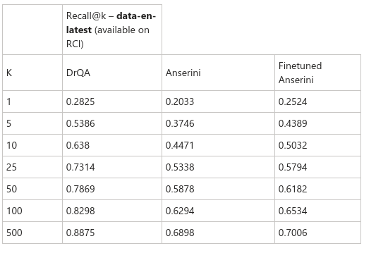

# Anserini Experimenting

Experimenting with Anserini library, which provides very efficient implementation of BM25 / TF-IDF algorithms. 
These models provide very solid baseline for information retrieval like tasks. Results are compared with 
DRQA implementation.

Anserini is a very solid baseline recommended to use. Anserini is much faster in computation of a tf-idf index 
where the computation takes only tens of minutes compared to DRQA several hours. Regarding *Recall* both implementations 
are very similar, see the below table.

Run in following order:
    1. compute_index
    2. finetune BM25 and use the hyperparameters saved in runs folder (this step can be skipped)
    3. retrieve

## Useful links:
- https://github.com/castorini/anserini/blob/master/docs/experiments-fever.md
- https://github.com/castorini/anserini-notebooks
- https://sigir.org/wp-content/uploads/2019/01/p040.pdf